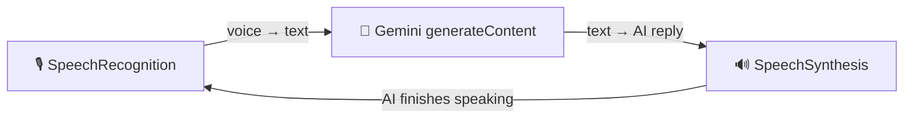

# AI Interview Coach

A voice-powered AI interview practice tool built with Next.js, Google Gemini, and browser-native speech APIs. The AI conducts technical interviews — it speaks questions aloud, listens to your responses, and follows up in real time.

## Course modules

This project is built across three video modules. Each module has its own branch so you can follow along or jump to any point in the build.

| Module |   Branch  | What's covered |
|--------|-----------|----------------|
| 1. Conversational UI canvas | [`module-1`](../../tree/module-1) | Project scaffolding, sidebar, listening view, idle view, phase-driven component architecture |
| 2. Wiring voice streaming | [`module-2`](../../tree/module-2) | `useGeminiLive` hook, SpeechRecognition (STT), Gemini `generateContent` API, SpeechSynthesis (TTS), hybrid auto-listen / press-to-talk fallback |
| 3. Deploying to Vercel | [`module-3`](../../tree/module-3) | Vercel deployment, environment variables, production considerations |
| **Complete project** | [`main`](../../tree/main) | Final state with all modules combined |

## Architecture



No WebSocket streaming, no audio buffers — three browser/API building blocks in a loop.

## Getting started

1. Clone the repo and install dependencies:

```bash
git clone https://github.com/Verifieddanny/ai-interviewer-classroom-io.git
cd ai-interviewer-classroom-io
npm install
```

2. Create a `.env` file with your Gemini API key:

```
NEXT_PUBLIC_GEMINI_API_KEY=your_key_here
```

Get a key from [Google AI Studio](https://aistudio.google.com/apikey).

3. Run the dev server:

```bash
npm run dev
```

4. Open [http://localhost:3000](http://localhost:3000), enter your name and a job description, and start an interview session.

## Tech stack

- **Next.js 16** — React framework
- **Tailwind CSS v4** — Styling
- **Google Gemini** — AI text generation (`generateContent` endpoint)
- **Web Speech API** — Browser-native speech-to-text and text-to-speech
- **Vercel** — Deployment

## Browser support

- **Safari** — Full auto-listen support
- **Chrome** — Full auto-listen support
- **Arc / other Chromium** — Falls back to press-to-talk (spacebar or button) if auto-listen fails
